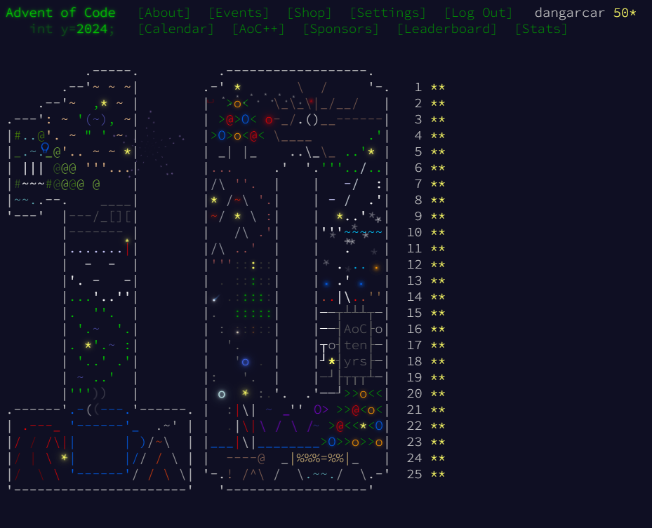

# My advent of code

My solutions to the Advent of Code of 2023, 2024 and 2025.

Some of the days have only the solutions of part 2, as I wrote it over the part 1 solutions.

When a day has two solutions is because the part 1 and part 2 solutions are very different and I have not written the part 2 over the part 1 solution.

I haven't uploaded the inputs as mentioned in the [AoC web](https://adventofcode.com/2023/about)

## 2023

## 2024

## 2025
