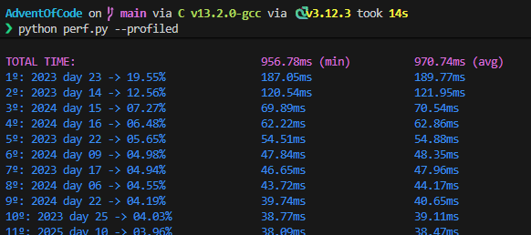
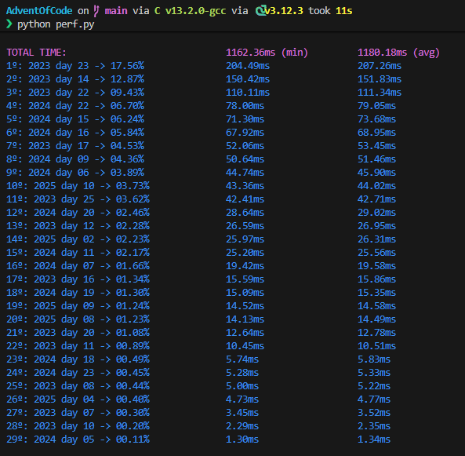
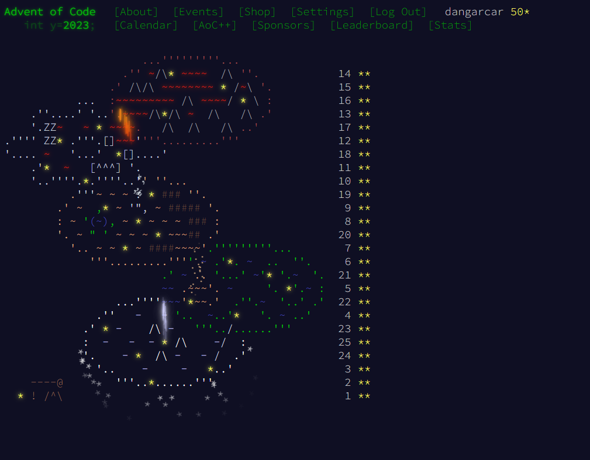

# My advent of code

My solutions to the Advent of Code of 2023, 2024 and 2025 in C++20.

Some of the days have only the solutions of part 2, as I wrote it over the part 1 solutions.

When a day has two solutions is because the part 1 and part 2 solutions are very different and I have not written the part 2 over the part 1 solution.

I haven't uploaded the inputs as mentioned in the [AoC web](https://adventofcode.com/2023/about)

## Performance
I've tried to make them run as fast as possible, so there is the script called `perf.py` that compiles everything and runs it.

If in every folder of every problem there is an input file with the name of the program, for example `1.in` for day 1 of any year, in linux you could run the script given that you have g++ with C++20 and Python.

Every program is compiled with `-O2` and the time measured is execution time, not launch program time, with the `AOC.h` utility that I made 

There is also a new option in the `perf.py` script: `--profiled`, that makes use of the `-fprofile-generate` and `-fprofile-use` options of the g++ compiler, but since the profiling is made with the real problem input, I don't know if that could be considered cheating in some sort of way. Anyways I've created that option since it reduces the time a lot on some branch-heavy, low-memory days, like day 10 2025

### My results
With my Ubuntu WSL2 32gb ram 13th gen i7 machine the sum of the execution times of every program is consistently under 1.2 seconds, getting under a second with profiling enabled

#### With --profiled

#### Without profiling

## 2023

## 2024

## 2025
